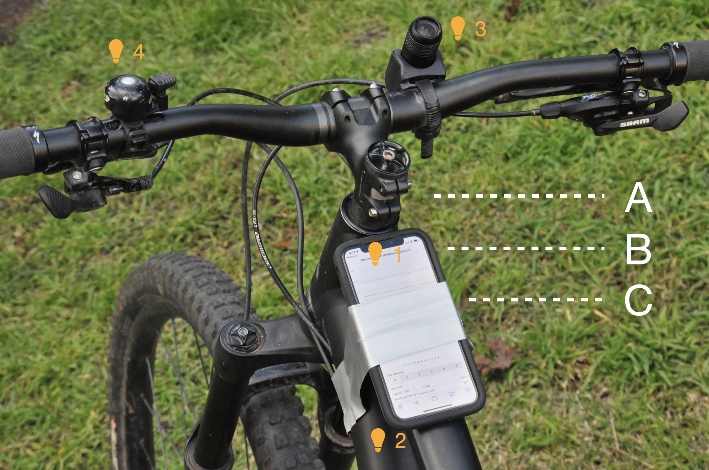
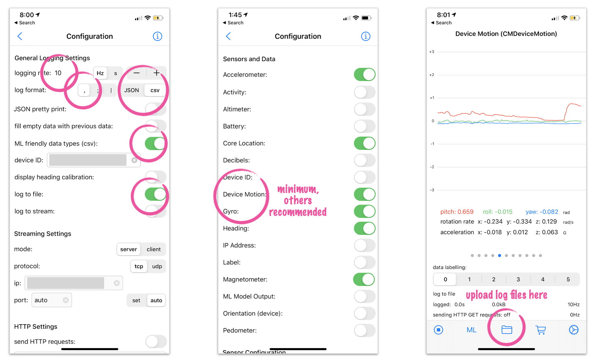

# wheelies-public
Code resources for the wheelie project - track your wheelie data and improve.

## Data Collection Rig

### Hardware

It doesn’t get much slicker than this. The hardware comprises:
* 1 bike (A)
* 1 smartphone (B)
* 1 roll duct tape (C)

Using a generous amount of duct tape (C), affix the phone (B) to the top tube of the bike (A) near the head. 

Pro-tips:
1. First, open the SensorLog app (see below)
2. Position the duct tape so that (i) the “Device Motion” traces are visible for a cool cockpit display and (ii) it’s easy to press the record button at bottom left
3. For nocturnal wheelies, a front light pointing down illuminates the ground in front when the wheel is up in the air
4. A bell may be required by law for riding local streets in Australia

### Software

The software comprises:
* [SensorLog](http://sensorlog.berndthomas.net/) app for iOS (or consider AndroSensor for Android)
* Google Drive account and app installed on the phone
* [Process Sensor Data](process_sensor_data.ipynb) notebook to run on [Colaboratory](https://colab.research.google.com/) 

To configure the data logged:
* Set SensorLog to log to a file on the device 
* Select CSV format
* Set desired logging frequency. I have settled on 10Hz, but will review in future.
* Log the following sensors: minimum: “Device Motion”; recommended, add: Accelerometer, Core Location, Gyro, Heading, Magnetometer (or Android equivalents)

After each session, the recorded data can be uploaded to a Google Drive folder as a CSV file.

## Data Processing Notebook

See [Process Sensor Data](process_sensor_data.ipynb) notebook to run on [Colaboratory](https://colab.research.google.com/)

## Future ideas
* Consider calculating Time-Of-Flight (ToF) for speed of movement.
** Best speed for wheelie ?
** Entry vs Exit speed
* Consider calculating "steadiness" of other axis - is the wheelie straight ?
