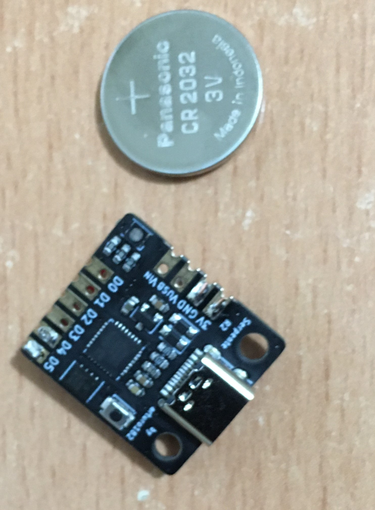
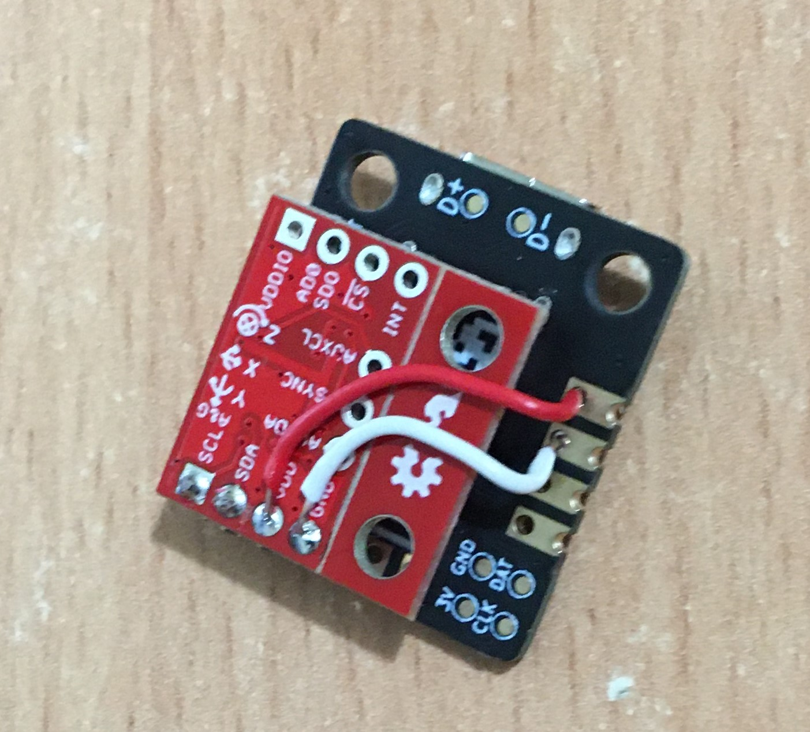

# Using a Serpene R2 for data collection
This folder contains references for using a Serpente R2

This is a different approach to the original suggestion using a smartphone.

### Motivation
This simple embedded hardware allows offline-first data collection.

* The smartphone app is commercial and needs to be purchased
* Google Drive to store data on the internet
* Using Google Colab also requires a fee for extended use 

### Rational
I chose this hardware because:
1. Compact size
2. Relatively low cost
3. Ease of use
4. Low power consumption
...and its just what I had available. 
 
## Hardware
Using a Serpente R2 microcontroller simply attach a IMU (Intertial Measurement Unit) sensor to the I2C bus and add power

* https://www.tindie.com/products/arturo182/serpente-a-tiny-circuitpython-prototyping-board/ ~ $20.99 AUD
* https://core-electronics.com.au/sparkfun-imu-breakout-mpu-9250.html ~ $23.20
* https://core-electronics.com.au/20mm-coin-cell-breakout-board-cr2032.html $5.64

Total Cost ~ $49.83

In this example I used a MPU9250 based IMU (9DoF) sensor. See TODO section for alternative sensors.

### Hardware Assembly
Simply solder the SDL, SCA pins together and use the 3v OUT and GND pins between the R2 and the sensor.

Attach the cell battery to the 

## Software
The Serpente R2 supported CircuitPython which is simple and easy to use.

### Software Assembly
Plugging the Serpente R2 into the USB port should present a disk that can be mounted much like any USB storage device.
Simply copy this folder to the toplevel directory of that storage and reset 

## Using
To use the board, simply install the battery and attach to your bike.

In normal operation:
* Green blinking LED indicates it is capturing and recording movement on the device
* Red blinking LED indicates a problem
* Blue blinking LED indicates it is writing the data on the controller

Plugging the device back into your computers USB port should give you:
1. measurements.csv - This contains the measurements
2. syslog.txt - This contains any error/issues that were encountered

## Testing
Attach the USB cable and use a terminal (eg Seaial on OSX or Putty on Windows or Screen on Linux) to access the serial console on the device
This will display the readings rather than writing them to the CSV file 

## Notes
* When the Serpente R2 is plugged into the USB port, it will not be able to write to the file system. You will see these warnings in the console whilst testing.

## TODO
1. Consider using a cheaper IMU such as an MPU-6050 $12.05 AUD to reduce cost
2. Change to Lithium Ion rechargeable cell such as https://www.sparkfun.com/products/13853 to reduce waste $7.96 AUD
3. Rechargeable cell may also need a https://www.pololu.com/product/2842 to align with the R2's power requirements
4. Test run times to get a better indication of current draw / battery life
5. Add piezo buzzer to give realtime feedback (eg. pitch=elevation, final chime to indicate total time relative to best effort)
6. Add GPS or other sensors to correlate wheelie success with location
7. Add log file roll-over to avoid filling up the 4MB capacity of the R2
8. Add 3D printable case